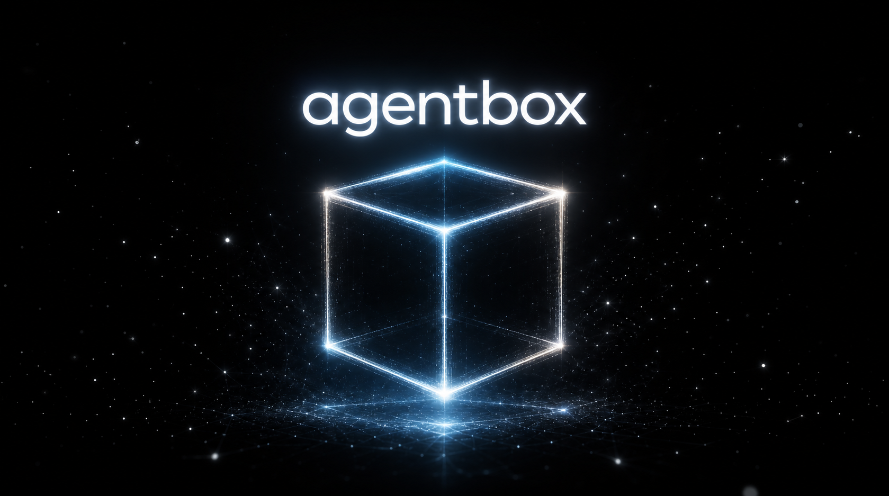

<p align="center">
  
</p>

# agentbox

**The AI Agent Framework — Sandboxed Multi-Agent Orchestration, High-Throughput Stateful Agents, Modular Agent Session Manager & Runtime.**

agentbox lets a SaaS backend run coding agents (pi / codex / claude code) as its execution engine. A user request comes in through your API, agentbox acquires a session, runs the agent inside an isolated workspace with a task-specific harness, and returns the artifacts. Declare one harness per task type — PPT generation, document generation, bash script generation, anything an agent can build inside a workspace.

```
user → SaaS client → API call → agentbox
        └ acquire session (reused when warm)
          → run harness (codex / claude / pi)
          → collect & return artifacts
```

## Why

Running a general-purpose coding agent server-side is powerful but raises four problems at once:

1. **Isolation** — different users/projects must never touch each other's files.
2. **Throughput** — many concurrent sessions, and follow-up requests for the same unit of work should reuse an already-warm session instead of rebuilding context.
3. **Minimal tool surface** — an agent with every tool enabled is slower and riskier. "Generate a PPT" only needs file writes and `node`. Tool surface should be declared per task type.
4. **Pluggable backends** — the same harness should run on pi, codex, or claude code.

agentbox makes these four the core contract of the framework.

## Core concepts

- **Harness** — an execution profile for one task type: backend, model, system prompt, tool allowlist, workspace seed, artifact globs, turn/time limits.
- **Session** — one `(userId, goalId)` pair owning one workspace and per-backend resume state. Follow-up requests for the same pair are routed to the same warm session (claude `--resume`, codex `exec resume`).
- **Sandbox** — workspace isolation behind a provider interface. Process-level (`local`) by default; container/microVM providers plug in behind the same interface.
- **Driver** — a backend adapter that translates the harness declaration into backend-native flags and normalizes output streams into common run events.
- **FairScheduler** — a global concurrency cap, per-user round-robin lanes, optional per-user concurrency caps, and bounded queueing with fast-fail backpressure and queue timeouts.
- **Operations built in** — per-harness retry policies, lifecycle hooks (`onRunStart` / `onEvent` / `onRunEnd`), runtime metrics (`/v1/stats`), workspace quotas, per-harness secret scoping, artifact stores (local archive or dependency-free S3/SigV4), and graceful drain on shutdown.

See [docs/DESIGN.md](docs/DESIGN.md) for the full architecture.

## Usage

```ts
import { Agentbox, defineHarness } from 'agentbox';

const pptGenerate = defineHarness({
  name: 'ppt-generate',
  backend: 'claude',
  systemPrompt: 'Produce out/deck.pptx inside the workspace.',
  tools: { allow: ['Read', 'Write', 'Edit', 'Bash(node:*)'] },
  artifacts: { globs: ['out/**/*.pptx'] },
  limits: { maxTurns: 30, timeoutMs: 480_000 },
});

const box = new Agentbox({ maxConcurrentRuns: 8 });
box.register(pptGenerate);

const result = await box.run({
  session: { userId: 'u1', goalId: 'q2-deck' },
  harness: 'ppt-generate',
  prompt: 'A five-slide deck summarizing Q2 results',
});
console.log(result.artifacts); // [{ path: 'out/deck.pptx', ... }]
```

Or run it as an HTTP server:

```sh
npx tsx examples/server.ts
curl -N localhost:8787/v1/runs -d '{
  "session": { "userId": "u1", "goalId": "q2-deck" },
  "harness": "ppt-generate",
  "prompt": "A five-slide deck summarizing Q2 results"
}'
```

Events stream back as SSE (`run:start`, `agent:message`, `tool:call`, `run:done`, …) so your client can render progress without knowing which backend is underneath.

## Markdown harnesses

TypeScript `defineHarness` is the escape hatch; markdown is the authoring format for the common case. A harness file is skill-shaped — YAML frontmatter for the spec, body as the system prompt:

```markdown
---
name: ppt-generate
backend: claude
tools: { allow: [Read, Write, "Bash(node:*)"] }
artifacts: [out/**/*.pptx]
limits: { maxTurns: 30, timeoutMs: 480000 }
---
You are a presentation-generation harness.
Produce exactly one file: out/deck.pptx.
```

Load a directory of them at boot — one markdown file is one task type:

```ts
await box.loadHarnessDir('./harnesses', { watch: true });
```

With `watch: true` the runtime hot-reloads: edits re-register, deletions unregister, and a mid-edit broken save keeps the previous registration in place. `name` defaults to the file basename.

## Harness packs

Harness directories travel as packs — a git repo or local folder of `*.md` harnesses with an optional `agentbox-pack.json` manifest (`name`, `version`, `description`, `harnesses` subdir):

```sh
npx agentbox add https://github.com/acme/office-pack   # git
npx agentbox add npm:@acme/office-pack                 # npm registry
npx agentbox add ./office-pack                         # local dir or .tgz
npx agentbox list
npx agentbox remove office-pack
```

Packs install into `.agentbox/packs` (staged and validated first — a pack with broken harness files is rejected before it lands) and the runtime picks them up at boot:

```ts
await box.loadHarnessPacks(); // registers every installed pack
```

## Container isolation

When process-level isolation is not enough, plug in the docker-based provider and opt harnesses in with `sandbox: 'container'`. The workspace stays a host directory (volume = session); each run executes in an ephemeral `docker run --rm` container with the workspace bind-mounted, and a per-session home keeps backend resume state warm across containers:

```ts
import { Agentbox, ContainerSandboxProvider } from 'agentbox';

const box = new Agentbox({
  sandboxProviders: [
    new ContainerSandboxProvider('.agentbox/sessions', {
      image: 'my-agent-runner:latest', // image with the agent CLIs installed
      extraArgs: ['--memory', '2g', '--cpus', '2'],
    }),
  ],
});
```

Runs can be cancelled mid-flight — `box.cancel(runId)` in the SDK, `DELETE /v1/runs/{runId}` over HTTP (the id arrives in the `run:start` event). A running driver is killed; a queued run is dropped before it ever spawns.

## Locking down

Give a key a tenant binding so a leak exposes one tenant, not the fleet:

```ts
createHttpServer(box, {
  keys: [{ key: 'acme-key', userIds: ['acme-1', 'acme-2'], harnesses: ['ppt-generate'] }],
});
// acme-key can only run ppt-generate for its own users; 403/404 otherwise.
```

Constrain container network reach to a domain allowlist:

```ts
import { startEgressProxy, ContainerSandboxProvider } from 'agentbox';

const proxy = await startEgressProxy({ allowedDomains: ['api.anthropic.com', '*.npmjs.org'] });
new ContainerSandboxProvider('.agentbox/sessions', {
  image: 'my-agent-runner:latest',
  egressProxyUrl: proxy.url, // agents can reach only the allowlisted domains
});
```

## Scaling out

Workspace snapshots make session creation cheap: build the expensive environment once, clone it copy-on-write per session:

```ts
await box.snapshots.create('deck-env',
  { seedFiles: { 'package.json': '…' } },
  { prepare: ['npm', 'install'] });
// harness: workspace: { snapshot: 'deck-env' }
```

For multiple nodes, each agentbox instance stays single-node and a gateway pins sessions to their home node by consistent hash — SSE streams proxy through, lookups fan out, stats aggregate:

```ts
import { createGatewayServer } from 'agentbox';

createGatewayServer(
  [
    { id: 'node-1', url: 'http://10.0.0.5:8787' },
    { id: 'node-2', url: 'http://10.0.0.6:8787' },
  ],
  { apiKeys: ['client-key'], nodeApiKey: 'internal-key' },
).listen(8080);
```

## Benchmarks

Framework overhead only — drivers are simulated, so this measures agentbox's scheduling, session management, state persistence, and artifact collection, not LLM latency. Reproduce with `npx tsx bench/throughput.mts` (numbers below: Node 22, Apple M5).

| Scenario | Result |
|---|---|
| Pure overhead (0ms driver, 200 runs, 20 sessions, concurrency 8) | 8,514 runs/s; p50 14ms / p95 22ms per run including queue wait |
| Simulated agent (300ms driver, 200 runs, 40 sessions, concurrency 16) | 43.8 runs/s — 82% of the theoretical 53.3 runs/s ceiling |
| Burst fairness (1 heavy user's serialized session + 9 light users) | 100 runs, 0 failed, light users never starved |

## Development

```sh
npm install
npm run typecheck
npm test
```

Zero runtime dependencies; TypeScript, `tsx`, and `@types/node` are dev-only.

## Observability

`GET /v1/stats` returns JSON (sessions, running/queued/active runs, totals by status, average duration); `GET /metrics` returns the same figures in Prometheus text format, scrapable without auth. Lifecycle hooks (`onRunStart` / `onEvent` / `onRunEnd`) feed any external tracer. For container fleets, `ContainerSandboxProvider.warm()` pre-pulls the run image at boot so the first run skips pull latency.

## Status

v1.0 — first stable release. Core runtime (local sandbox, three backend drivers, session manager, fair scheduler, HTTP/SSE facade with API-key auth, tenant binding, run history, and Prometheus `/metrics`), markdown harness authoring with hot reload, docker-based container isolation with domain-allowlist egress control and image warm pools, run cancellation, an operations layer (backpressure, per-user caps, retries, hooks, metrics, quotas, secret scoping, MCP injection for claude and codex, graceful drain), harness packs (git/npm/tarball/local) with an `agentbox add/list/remove` CLI, artifact stores, resume-state persistence across restarts, session pre-warming, copy-on-write workspace snapshots, and multi-node scale-out via a consistent-hash gateway. The claude and codex drivers are verified end-to-end against the real CLIs (warm resume included), and the container sandbox and egress proxy against a real docker daemon. Full history in the [CHANGELOG](CHANGELOG.md).

## Contributing

Issues and PRs are welcome — see [CONTRIBUTING.md](CONTRIBUTING.md).

## License

[MIT](LICENSE)
